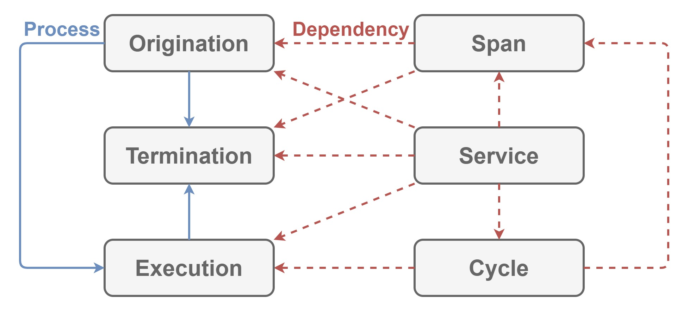

# Construction

This module extends [Periodization](./Periodization.md) to define how to

- configure
- build

XR applications.

## Dependencies

This module depends on [Periodization](./Periodization.md).

## Architecture

| Word | Abstraction |
|:-|:-|
| Service | Builder for `Cycle`. |

`Service` configures `Origination`, `Termination`, `Execution` and `Span` to build `Cycle`.

## Implementation

Nothing except internal implementations for [Construction](./Construction.md).
