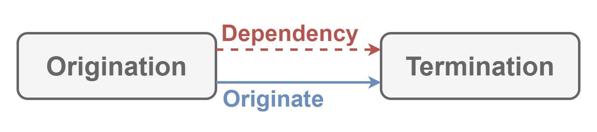

# Periodization

This module defines

- initialization
- running
- finalization

for your

- applications
- infrastructures

and so on.

## Dependencies

Nothing.

## Architecture

| Word | Abstraction |
|:-----------|:------------|
| Origination | Token to initialize. |
| Termination | Token to finalize. |
| Execution | Token to run. |
| Span | Lifetime from `Origination` to `Termination`. |
| Cycle | Lifecycle for `Execution` between `Origination` and `Termination`. |

`Origination` initializes applications, infrastructures, and so on.
`Termination` finalizes applications, infrastructures, and so on.
`Execution` runs task for applications.
`Span` is `Origination` and `Termination`.
`Origination` and `Termination` can be converted to `Span`.
`Cycle` is `Execution` between `Origination` and `Termination`.
`Execution` and `Span` can be converted to `Cycle`.
`Execution`, `Origination` and `Termination` can be converted to `Cycle`.

## Implementation

Nothing because this module only defines defines

- initialization
- running
- finalization

for your

- applications
- infrastructures

and so on.
