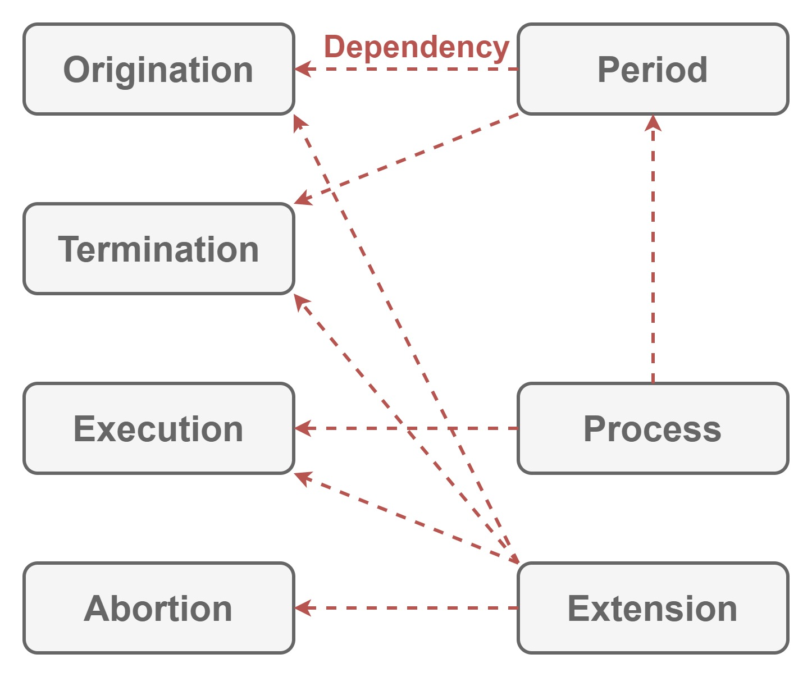

# Progression

This module defines how to

- initialize
- perform
- finalize

applications, infrastructures, and so on.

This module also defines how to handle error.

## Dependencies

Nothing.

## Architecture

| Word | Abstraction |
|:-----------|:------------|
| Origination | Token to initialize. |
| Termination | Token to finalize. |
| Execution | Token to perform. |
| Period | Term from `Origination` to `Termination`. |
| Process | `Period` for `Execution`. |
| Abortion | Token to abort exception. |

`Origination` initializes applications, infrastructures, and so on.
`Termination` finalizes applications, infrastructures, and so on.
`Execution` performs task.
`Period` is `Origination` and `Termination`.
`Process` is `Period` and `Execution`.

`Abortion` can be bound to `Origination`, `Termination` and `Execution` to deal with exceptions thrown in them.

## Implementation

Nothing because this module only defines how to

- initialize
- perform
- finalize

applications, infrastructures, and so on.
