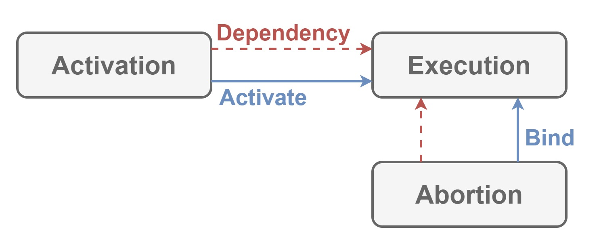

# Violation

Violation expands [Progression](./Progression.md) to define how to deal with exceptions thrown in applications.

## Dependencies

This module depends on [Progression](./Progression.md).

## Architecture

| Word | Abstraction |
|:-----------|:------------|
| Abortion | Token to abort when `Execution` has thrown exceptions. |

`Abortion` can be bound to `Execution` to deal with exceptions thrown in `Execution`.

## Implementation

Nothing except internal implementations for some interfaces of [Progression](./Progression.md), because this module only defines how to deal with exceptions thrown in applications.
