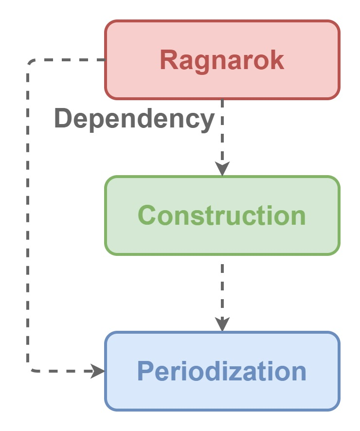

# YggdrAshill.Ragnarok: a lifecycle framework

Ragnarok defines how to

- initialize
- run
- finalize

applications for mainly XR (VR/AR/MR).  
This framework isolates definitions from implementations for lifecycle.

- ex) [Unity](https://unity.com/ja)
- ex) [Xamarin](https://docs.microsoft.com/ja-jp/xamarin/get-started/what-is-xamarin)
- ex) [ASP.NET Core](https://docs.microsoft.com/ja-jp/aspnet/core/fundamentals/host/generic-host)
- ex) [Generic Host](https://docs.microsoft.com/ja-jp/dotnet/core/extensions/generic-host)
- ex) [Windows Presentation Foundation (WPF)](https://docs.microsoft.com/ja-jp/visualstudio/designers/getting-started-with-wpf)

## Dependencies

This framework depends on .NET Standard 2.0.

## Installation

Developers should

1. Go to [Release pages](https://github.com/do-i-know-it/YggdrAshill.Ragnarok/releases).
1. Download the latest version.

to use this framework.

## Usage

Please see [Sample applications](https://github.com/do-i-know-it/YggdrAshill.Ragnarok/tree/main/YggdrAshill.Ragnarok.Samples).

## Architecture

This framework consists of core modules below.

- [Periodization](./Documentation/Periodization.md)
- [Construction](./Documentation/Construction.md)

[Implementation](./Documentation/Implementation.md) module is an entry point of this framework, providing

- implementations
- extensions

for core modules.

## Known issues

Please see [GitHub Issues](https://github.com/do-i-know-it/YggdrAshill.Ragnarok/issues).

## Future works

Please see [GitHub Projects](https://github.com/do-i-know-it/YggdrAshill.Ragnarok/projects/1).

## License

This framework is under the [MIT License](https://opensource.org/licenses/mit-license.php), see [LICENSE](./LICENSE.md).

## Remarks

This framework is a part of YggdrAshill framework.  
Other frameworks will be produced soon for YggdrAshill.
